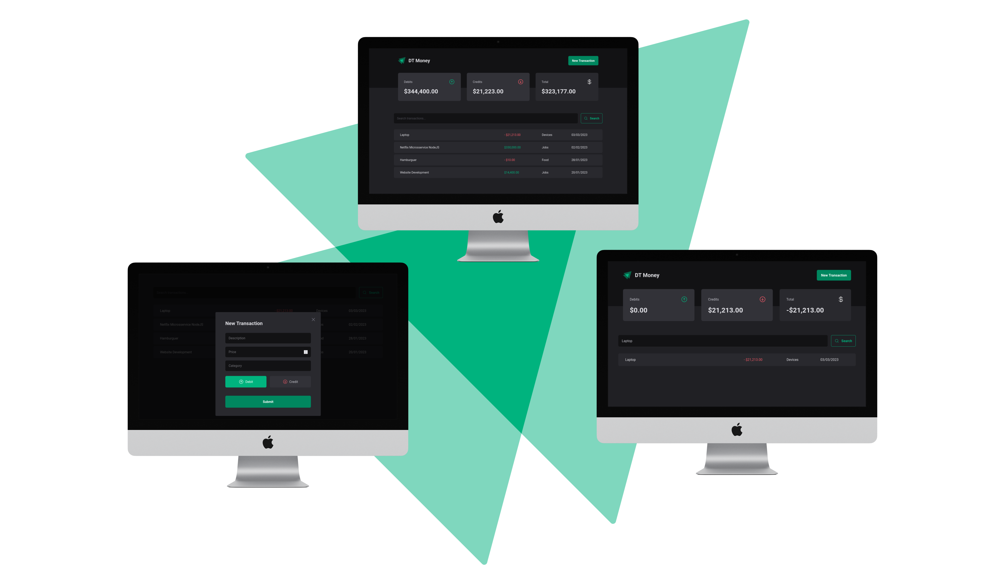

<p align="center">
  <a href="https://pomodoro-timer-ebon.vercel.app/">
 </a>
</p>

<h3 align="center">Ignite Project</h3>

<p align="center">


</p>

---



---

<p align="center"> This app was created on Rocketseat course and was build to improve the ReactJS advanced concepts, like, useCallback, memo and useMemo. It's resume the best options to api RESTFUll request from frontend to backend. Language: Typescript, some libs: Axios, Styled Components, Radix-UI, React hook form and more.
</p>

## 📝 Table of Contents

- [About](#about)
- [Getting Started](#getting_started)
- [Usage](#usage)
- [Built Using](#built_using)
- [Authors](#authors)

## 🧐 About <a name = "about"></a>

This project is the third part of Rocketseat ReactJs course with i am using to stay solid with the most actual and best practices on frontend projects. This project simulate a wallet in a bank account with transactions options and monetary balance.

## 🏁 Getting Started <a name = "getting_started"></a>

You can clone the project and start on your local host or open the site hospeded <a href="https://ignite-social-ten.vercel.app">here</a>

Clone

```
git clone https://github.com/raferdev/dt_money
```

Install Dependencies

```
npm i
```

Start Server

```
npm run dev
```

The browser will remote open on the local link on port 5173 (usually in Vite projects). Exemple .:

```
http://localhost:5173
```

## 🎈 Usage <a name="usage"></a>

You can add new project on the text input and set the duration in minutes on the right side.

- Click on start button.
- You can cancel it when you decide just click on the stop button.
- When the timer comes to zero the task automaticaly goes to history has done and you can start another task.
- Click on the icon "paper" on the top right side to go to history page, here you can see the list of tasks you finished, cancel or are running.

## ⛏️ Built Using <a name = "built_using"></a>

- [HTML](https://developer.mozilla.org/pt-BR/docs/Web/HTML) - Markup Language
- [Styled Components](https://styled-components.com/) - CSS Superset
- [Typescript](https://developer.mozilla.org/pt-BR/docs/Web/typescript) - Javascript with super powers language
- [ReactJS](https://pt-br.reactjs.org/) - Javascript Superset Library
- [Vite](https://pt-br.reactjs.org/) - Next Generation Frontend Tooling

## ✍️ Authors <a name = "authors"></a>

- [@raferdev](https://github.com/raferdev) - build
- [@rocketseat](https://github.com/rocketseat) - idea
